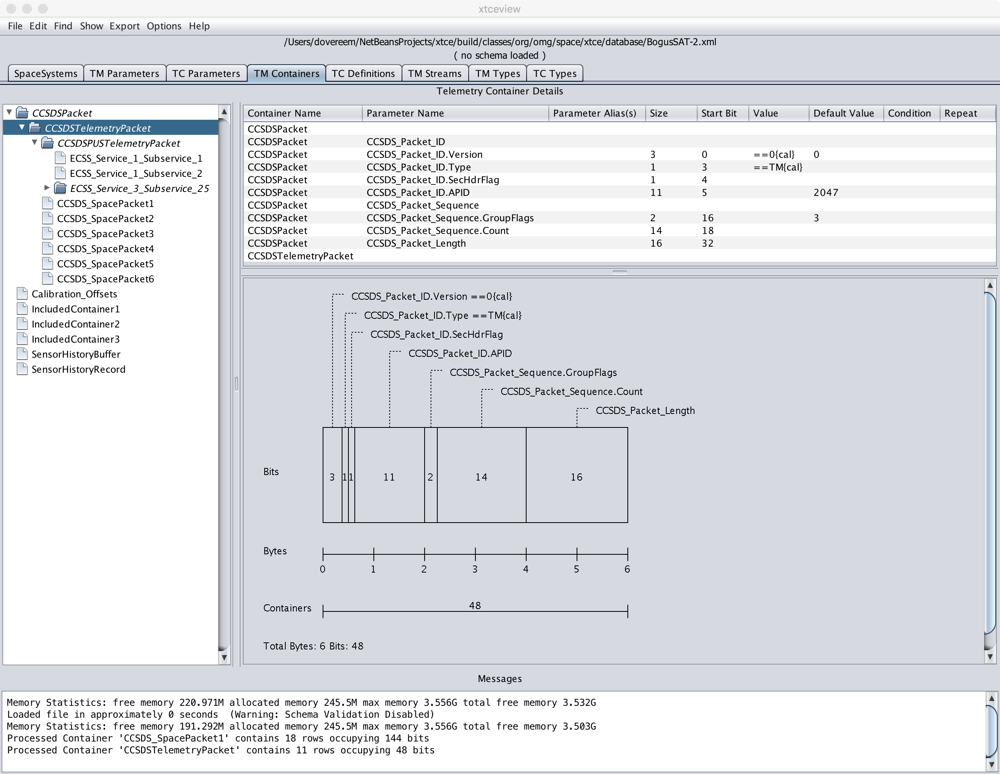

# XTCE Toolkit README #

The XTCE Toolkit provides both a native Java library and a Graphical User
Interface, based on that library, to support the OMG XML Telemetric and
Command Exchange (XTCE) standard.

The toolkit does not depend on any graphical interfaces.  Further, the
graphical user interface "xtceview" contains little to no business logic,
preferring to be a graphical wrapper around the toolkit package.  To
supplement this, a number of examples, sample databases, and schema
documentation are also included.

### Purpose ###

The XTCE Toolkit project supports the user community of the XTCE specification
by attempting to:

* Provide a program and platform independent viewer/editor for satellite
databases stored in XTCE format.  Visualization of large XML data sets is a
struggle without the assistance of a higher level tool.

* Provide an API that is relatively easy to use, with a minimum of training,
and does not otherwise require understanding of all of the internal complexity
of the XTCE specification.  The specification is very complex, which makes it
powerful enough to represent any program, but non quick or easy to use for
programmers.

* Provide a means to validate and/or "cross check" other satellite C2 systems
and tools by providing an internal encoder/decoder to enable round trip
conversion of Telemetry, Telecommand, Table, and various forms of Log or
Buffer data, when represented in the XTCE data model.

### Note On The Specification ###

This project is primarily aimed at supporting the XTCE 1.2 specification that
has yet to be released by the <a href="http://space.omg.org/index.htm">
Object Management Group Space Domain Task Force</a>.  XTCE XML documents that
are compliant with the existing 1.1 specification will work with this library
in many cases, although some intervention may be required on elements which are
known to have spelling errors.  Enabling validation on the XML will report the
issues, should any exist during document loading.

The longer term strategy planned at present is to have this library/ui toolkit
automatically migrate XTCE 1.1 documents to XTCE 1.2 documents during the
loading process when the XTCE 1.2 specification is finalized.

### Key Features ###

* Supported by the author and tested regularly on Linux, Solaris, Mac OS/X,
and Windows platforms.
* Static Analysis by Coverity Scan for Open Source &nbsp;&nbsp;
  
* Telemetry Parameter access without needing to understand the XTCE data model,
relationships, references, or other complexities.
* Similar Telecommand and Argument access without needing to understand the
XTCE data model.
* Telemetry and Telecommand Container/Packet processing supporting most of the
XTCE schema complexity, reducing the output access to simple flattened
accessors such that the user need not understand or be aware of the
complexities of the XTCE data model.
* Extremely fast optimized searches for Parameters, Telecommands, and usage of
Parameters in Containers/Packets.
* Support for Streams and ability to link from Streams to specific
Containers/Packets.
* Ability to export from XTCE to other common formats, such as CSV, for use in
a spreadsheet.
* Regression tested using Java standard JUnit 4 classes.
* The toolkit and GUI are both conceived with idea of editing as well as
viewing in mind, although the edit features are only minimally complete.
* Round trip loading and saving operations while preserving comments and
formatting.
* The toolkit and GUI have both been proven on programs that utilize both CCSDS
Space Data Link and European ECSS Packet Utilization (PUS) standards.
* The toolkit and GUI are regularly used with satellite databases that
incorporate XInclude and in total are hundreds of megabytes in size.
Performance was a strong consideration in the design.
* I18/L10 Internationalization with support currently installed for both US
English and European French languages.
* An internal encoder and decoder for Parameters and Arguments that can serve
as a reference for other implementations of commutation and de-commutation
capabilities.
* XTCE 1.2 Release Candidate Schema support.

### Getting Started ###

The JAR file contains both the library and the graphical interface application.
It is self-executable with Java 7 or later.  In the event that Java 7 is used,
then the user will need to ensure that "jfxrt.jar" is on the CLASSPATH.  This
is used for the Help Menus, which may be the first capabilities desired.
Example launch scripts with Windows (.bat) and Unix (.sh) are provided in the
root of the source package.

A comprehensive API description in Javadoc is included in the JAR file and can
also be conveniently browsed from the Help Menu on the user interface under the
"On Toolkit API" Menu Item.

For the purposes of compiling and editing the source tree, the tar.gz file is
a NetBeans Project and will be automatically recognized by NetBeans 8 by
selecting the directory.  The user will need to adjust the path to the
dependent library "jfxrt.jar" on first load, to locate their native Java
library directory.  The Select the "Clean and Build" Menu Item or Button in
NetBeans to confirm the package can be built.  The internal unit tests use the
JUnit 4 facility and can be visually run by selecting "Run->Test Project" on
the NetBeans menu system.  A local copy of the "junit4" jar file may also have
to be selected if it cannot be automatically located.

Example Satellite Databases are included for testing/browsing/evaluation and
are built-in.  Select those from the graphical interface File Menu under
the item "Open Example Database".  The database named "BogusSAT-2" is a good
place to start.

### User Interface ###

The following image is a snapshot of the main user interface screen showing a
possible example representation of a CCSDS TM (Telemetry) Space Packet header.

 

 

### About The Author ###

The initial author of this software is an active member of the Task Force that
maintains the XTCE specification.

If this project interests you, perhaps these other projects that interest the
author would also be of interest to you.

* Comprehensive Open-architecture Solution for Mission Operations Systems
  * <a href="http://www.cosmos-project.org/">Hawaii Space Flight Laboratory</a>
  * <a href="http://cosmosrb.com/">Ball Aerospace</a>
* <a href="http://www.hbird.de/">Hummingbird</a>

The author is aware of XTCE implementations provided by commercial spacecraft
command and control vendors.  This list will be updated as the author is made
aware of any additional implementations that are tested and deployed to the
marketplace.  For each of these two products, the author has significant
experience integrating and using the offerings.  Using this open source XTCE
toolkit and these products can assure a rapid integration of a spacecraft TT&C
database.

* <a href="http://itservices.harris.com/oscomet.aspx">
  Harris Corporation OS/COMET Product</a>
* <a href="http://www2.l-3com.com/trf/incontrol/">
  L-3 Communications InControl Product</a>

